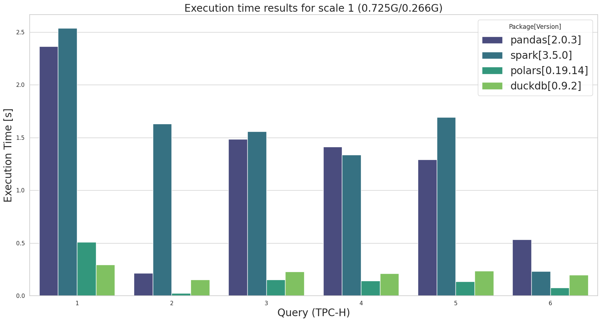
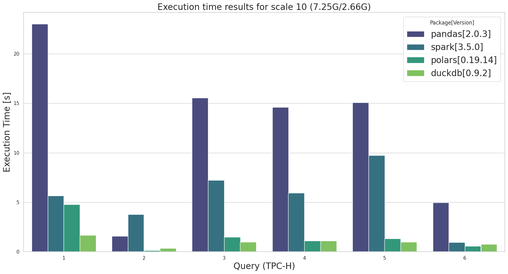
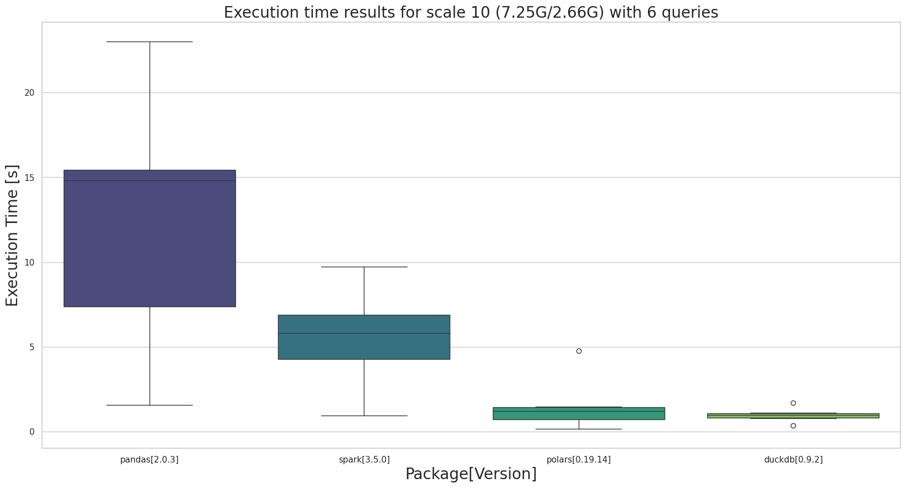
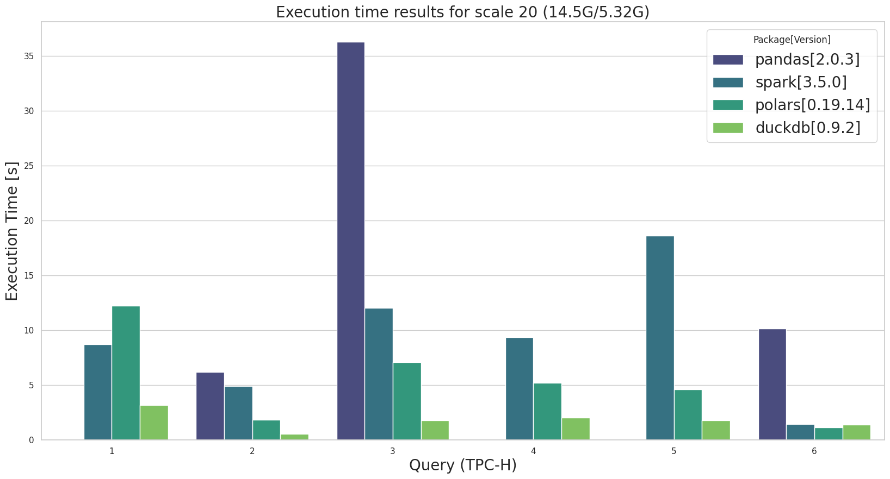
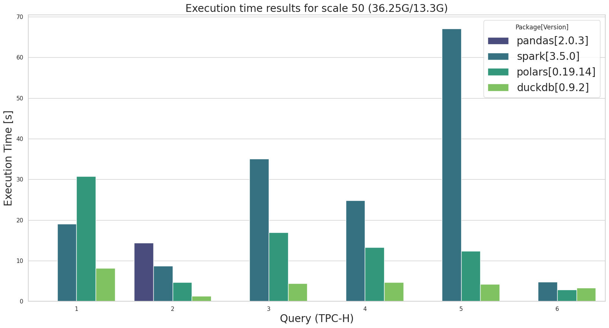
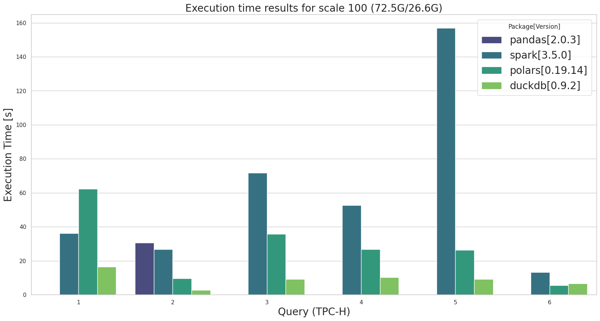
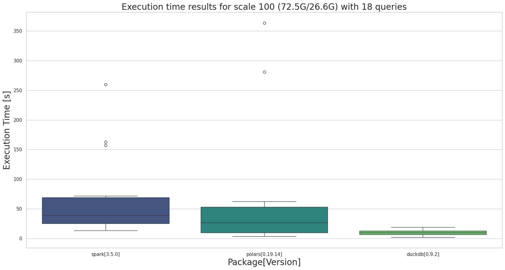

# Benchmarking Local Data Processing Libraries in Python: A Comparative Analysis (Light Talk)​

This repo contains sources and results for the light talk "Benchmarking Local Data Processing Libraries in Python: A Comparative Analysis" presented at Tefcon 2023.
It contains the python source code for several data libraries using the TPC-H benchmark. Source code is based on the one shared by Polars team with some modifications: <https://github.com/pola-rs/tpch>

## Results highlight

Below, you can find some interesting results from the comparison of 4 main data processing libraries in python:

- pandas
- pyspark
- polars
- duckdb

### Scale 1



### Scale 10




### Scale 20



### Scale 50



### Scale 100




## To run the tests

All testing is done inside tpch folder. First you will need to create a virtual environment:

```
make .venv
```

Then, you will need to generate the testing files. You can use the predefined testing datasets in the Makefile, as:

```
make tables_scale_1
```

You can modify the scale to the one you choose of the scales available in the Makefile.

Then, to reproduce the results above, you'll need to export the following env variables (SCALE_FACTOR set to the one you generated):

```
export SCALE_FACTOR=100;
export LOG_TIMINGS=True;
export STREAMING=True;
export INCLUDE_IO=True;
```

After than, to run the test, you just have to execute:

```
make run_all
```
